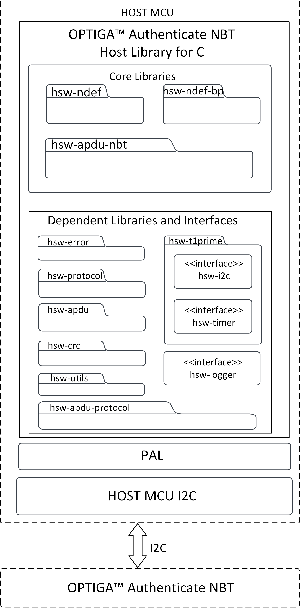
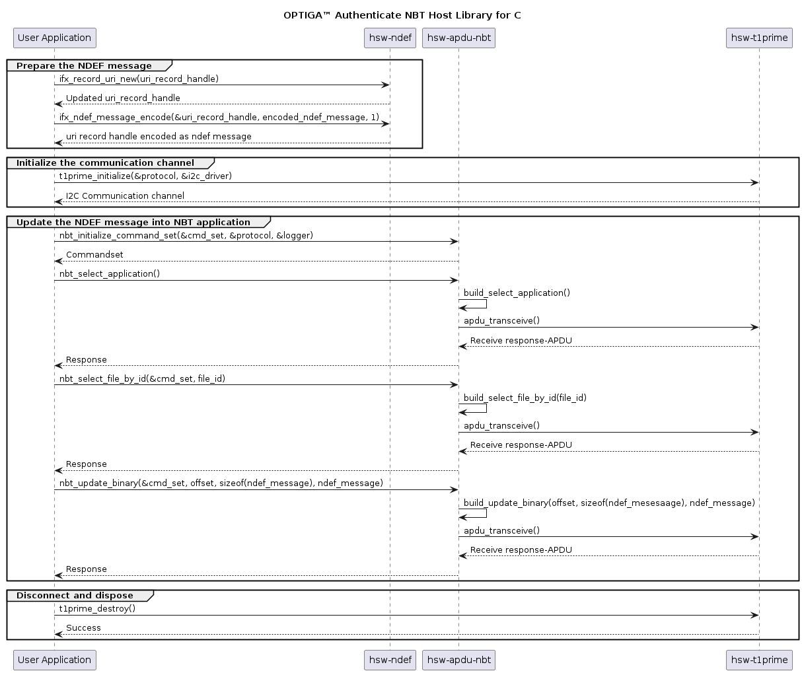

<!--
SPDX-FileCopyrightText: 2024 Infineon Technologies AG
SPDX-License-Identifier: MIT
-->

# OPTIGA™ Authenticate NBT Host Library for C: User guide

The OPTIGA™ Authenticate NBT Host Library for C offers an extensive API to interact with the OPTIGA™ Authenticate NBT and to utilize its full functionality. The host library is mainly intended to be used in C/C++ applications interfacing to the OPTIGA™ Authenticate NBT via I2C (for example: MCUs).

## Scope and purpose

This guide describes the features and functionality of the host library, including an architecture overview and descriptions of the host library's components. It also conveys the basic procedure to integrate the host library into existing applications.

## Intended audience

This guide is primarily intended for embedded application developers who target to integrate the OPTIGA™ Authenticate NBT Host Library for C into their embedded application running on an MCU to interact with the OPTIGA™ Authenticate NBT.

## Quick navigation

* [Key features](#key-features)
* [Host library architecture](#host-library-architecture)
  * [Core libraries](#core-libraries)
  * [Dependent libraries and interfaces](#dependent-libraries-and-interfaces)
* [Platform-specific implementations](#platform-specific-implementations)
* [Directory structure](#directory-structure)
* [Toolset](#toolset)
* [CMake build system](#cmake-build-system)
* [Integrating into an existing CMake project](#integrating-into-an-existing-cmake-project)
* [Integrating into ModusToolbox™ applications](#integrating-into-modustoolbox-applications)
* [Using a different build system](#using-a-different-build-system)
* [Library interaction](#library-interaction)
* [Library usage](#host-library-usage)
* [Additional information](#additional-information)
* [References](#references)

## Key features

* NFC-to-I2C bridge commands for interaction with the OPTIGA™ Authenticate NBT
* Sends command APDUs (C-APDU) and receives response APDUs (R-APDU) from the OPTIGA™ Authenticate NBT
* Configuration of the OPTIGA™ Authenticate NBT via its configurator application
* Personalization and operational commands to support simplified interaction with the OPTIGA™ Authenticate NBT
* NDEF host library that enables the host application to build, encode and decode NDEF records and messages
* NDEF host library that supports "NFC Forum well known type" and "NFC Forum external type"
* NDEF host library that provides brand-protection supported NDEF records
* Supports GlobalPlatform T=1' protocol for I2C communication between host MCU and OPTIGA™ Authenticate NBT

## Host library architecture

This host library provides high-level command abstractions to communicate with the OPTIGA™ Authenticate NBT. The library is composed of multiple sub-libraries and interfaces which are included in the host library package. The core libraries are designed to be platform-independent and they depend on a number of other libraries to provide their full functionality. Some of these dependent libraries require platform-specific implementations. Generic interfaces are provided by the host library package but concrete implementations of these interfaces need to be provided by the user of the host library with respect to the target platform.

### Core libraries

The OPTIGA™ Authenticate NBT Host Library for C includes three core libraries to interact with the OPTIGA™ Authenticate NBT.

* [hsw-apdu-nbt](../libs/hsw-apdu-nbt/README.md)
* [hsw-ndef](../libs/hsw-ndef/README.md)
* [hsw-ndef-bp](../libs/hsw-ndef-bp/README.md)



**hsw-apdu-nbt**

The NBT APDU library allows the host application to send C-APDUs to the OPTIGA™ Authenticate NBT and receive R-APDUs from the OPTIGA™ Authenticate NBT. This library is intended to be used with I2C as base layer of the communication channel (base layer of the Protocol interface).

**hsw-ndef**

The NFC Data Exchange Format (NDEF) specification by NFC Forum defines a common data format to exchange information between NFC Forum devices. This library provides support to build and parse NDEF messages, with support for common NDEF record type definitions. This library can be easily extended to support additional record type definitions.

**hsw-ndef-bp**

The NFC brand protection record library is an extension to the NDEF library to create and parse NFC brand protection records for the OPTIGA™ Authenticate NBT. This extended library includes NDEF records and parsers to provide the core brand protection functionality of the OPTIGA™ Authenticate NBT. Brand protection-specific encoding and decoding are handled by the library itself. But this library depends on the `hsw-ndef` library for registering its records and for further NDEF record and message manipulations.

### Dependent libraries and interfaces

The core libraries are dependent on several other libraries and interfaces. Detailed description of these dependent libraries is provided below.

| Dependent&nbsp;library                                   | Description                                                                                                                                                                                                                                                                                                                                                                                                                                                                                                                                                  |
| -------------------------------------------------------- | ------------------------------------------------------------------------------------------------------------------------------------------------------------------------------------------------------------------------------------------------------------------------------------------------------------------------------------------------------------------------------------------------------------------------------------------------------------------------------------------------------------------------------------------------------------ |
| [hsw-t1prime](../libs/hsw-t1prime/README.md)             | This dependent library implements the GlobalPlatform T=1' protocol which uses timer and I2C platform-specific interfaces to interact with the OPTIGA™ Authenticate NBT via I2C. This dependent library is provided as a separate protocol stack. This library can be built and linked to `hsw-apdu-nbt` core library to communicate via GP T=1' I2C protocol. This dependent library is dependent on interfaces such as timer and I2C. Platform-specific implementations of these interfaces are required to access full functionality of the library. |
| [hsw-error](../libs/hsw-error/README.md)                 | This dependent library is used for creating and parsing error information.                                                                                                                                                                                                                                                                                                                                                                                                                                                                                   |
| [hsw-protocol](../libs/hsw-protocol/README.md)           | This dependent library provides the communication protocol interface for the NBT APDU library. This dependent  library provides functionalities such as initialize, transceive and terminate to communicate with the OPTIGA™ Authenticate NBT. It can be implemented for any communication protocol such as I2C and UART.                                                                                                                                                                                                                              |
| [hsw-utils](../libs/hsw-utils/README.md)                 | This dependent library provides the utility methods such as for byte conversions, string conversions, bit operations, and encoders/decoders for TLV data.                                                                                                                                                                                                                                                                                                                                                                                                    |
| [hsw-apdu](../libs/hsw-apdu/README.md)                   | This dependent library is used to build the APDU command bytes and parse the APDU response bytes according to the ISO/IEC 7816-4 specification.                                                                                                                                                                                                                                                                                                                                                                                                              |
| [hsw-apdu-protocol](../libs/hsw-apdu-protocol/README.md) | This dependent library is used for sending and receiving APDU command bytes according to the ISO/IEC 7816-4 specification.                                                                                                                                                                                                                                                                                                                                                                                                                                   |
| [hsw-crc](../libs/hsw-crc/README.md)                     | This dependent library is a generic library used for CRC calculation. This library is used for CRC calculation of GlobalPlatform T=1' protocol stack.                                                                                                                                                                                                                                                                                                                                                                                                        |

The generic platform independent interfaces are provided with the host library to support easy porting to any target MCU. Concrete implementations of these interfaces for the respective target platform are needed to utilize this host library.

| Dependent&nbsp;interface                   | Description                                                                                                                                                                  |
| ------------------------------------------ | ---------------------------------------------------------------------------------------------------------------------------------------------------------------------------- |
| [hsw-i2c](../libs/hsw-i2c/README.md)       | This interface is used for the I2C protocol implementation of the GlobalPlatform T=1' protocol stack.                                                                        |
| [hsw-timer](../libs/hsw-timer/README.md)   | This interface is used for the timer implementation of the GlobalPlatform T=1' protocol stack.                                                                               |
| [hsw-logger](../libs/hsw-logger/README.md) | This interface is used for logging information/errors. It offers generic interface that can be populated by concrete implementations, such as file logger or console logger. |

## Platform-specific implementations

This host library is written with portability in mind. Wherever possible, platform-specific code is avoided and generic interfaces are used. These interfaces offer generic header files that can be included in any library that needs the functionality. A concrete implementation of these interfaces with respect to the target MCU is needed to utilize this host library.

This section will give an overview of the interfaces that need to be implemented to utilize the OPTIGA™ Authenticate NBT Host Library for C on arbitrary platforms.

**hsw-i2c**

`hsw-i2c` interface is used to abstract the I2C-specific communication functionality from the target platform. This interface is built on the `hsw-protocol` APIs. To implement concrete implementation of I2C driver, (at least) the following functions need to be provided. These functions shall mainly wrap the target MCU's I2C functions that can be used in `hsw-protocol` library.

* A function to initialize the `ifx_protocol_t` object with the concrete implementation (for example: `ifx_i2c_psoc6_initialize()`). This function sets up all members of the provided `ifx_protocol_t` struct and makes it usable in a generic protocol stack. This function shall do the platform-specific I2C driver initialization.

  * `ifx_protocol_t *self`: This object is populated in this function. It stores the protocol state, maps the I2C functions of host MCU and also holds the I2C protocol properties. The fields of `ifx_protocol_t` struct that needs to be populated in the function are:
    * `ifx_protocol_t* _base` : Base layer of I2C protocol in ISO/OSI stack. Since the I2C layer is the lowest layer of the stack - this is typically set to NULL.
    * `uint64_t _layer_id` : Layer ID to differentiate I2C protocol layer in a full ISO/OSI protocol stack.
      By default value is 0. This field can take values starting from 1 to differentiate the I2C protocol layer in full ISO/OSI protocol stack. For `hsw-i2c` protocol, _layer_id is set to 0x04.
    * `ifx_protocol_activate_callback_t _activate` : Function to activate I2C protocol. This function will perform the I2C protocol-specific parameter negotiation. This field can be NULL if I2C layer has no specific activation.
    * `ifx_protocol_transceive_callback_t _transceive` : Function to send and receive data via I2C at once. This field might be NULL but in that case ifx_protocol_t._transmit and ifx_protocol_t._receive must not be NULL.
    * `ifx_protocol_transmit_callback_t _transmit` : Function to send data via I2C. This field shall be set to platform-specific implementation of I2C data transmit function, which is detailed later in this section. This field might be NULL but in that case ifx_protocol_t._transceive must not be NULL.
    * `ifx_protocol_receive_callback_t _receive` : Function to receive data via I2C. receive must not be NULL.
    * `ifx_protocol_transmit_callback_t _transmit` : Function to send data via I2C. This field shall be set to platform-specific implementation of I2C data receive function, which is detailed later in this section. This field might be NULL but in that case ifx_protocol_t._transceive must not be NULL.
    * `ifx_protocol_destroy_callback_t _destructor` : Function to destroy I2C protocol properties. protocol_destroy() will call free() for ifx_protocol_t._properties. If any further cleanup is necessary, implement it in this function, otherwise use NULL.
    * `ifx_logger_t *_logger` : Optional Logger object. This field might be NULL if no logger is set.
    * `void *_properties` : Holds I2C-specific protocol properties/state such as slave address, guard time, and timer for guard time. This field might be NULL if no state is required.

* A function to transmit data from the host MCU to the OPTIGA™ Authenticate NBT via `I2C` (for example: `ifx_i2c_psoc6_transmit()`).
  This function must match the `ifx_protocol_transmit_callback_t` signature and takes three parameters:
  * `ifx_protocol_t *self`: This is the object populated by the initialization function described above.
  * `const uint8_t *data`: This is the data to be transmitted via I2C.
  * `size_t data_len`: This is the number of bytes in `data`.
  * Return value `IFX_SUCCESS`: Return value of the function if data is transmitted via I2C successfully.
  \
    Store a pointer to this function in `ifx_protocol_t._transmit` in `ifx_protocol_t` struct while initialization. This function shall implement the platform-specific I2C driver transmit functionality. This function must make sure that the I2C guard time is respected, which means await the guard time before transmitting the data (via joining timer) and starting the guard time timer after transmitting data.

* A function to receive data from the OPTIGA™ Authenticate NBT to host MCU via `I2C` (for example: `ifx_i2c_psoc6_receive()`)
  This function must match the `ifx_protocol_receive_callback_t` signature and takes four parameters:
  * `ifx_protocol_t *self`: This is the object populated by the initialization function described above.
  * `size_t expected_len`: This is the number of bytes to be read.
  * `uint8_t **response`: This is a pointer to a buffer to store the response.
  * Return value `IFX_SUCCESS`: Return value of the function if data is received via I2C successfully.
    To be usable in generic `ifx_protocol_t` structs, this function does not take an allocated buffer but **MUST** allocate the buffer itself using `malloc`. This is necessary because higher layers in the OSI model do not know the amount of response bytes at call time. For I2C, the size allocated must match `expected_len`.

    ```c
    // Allocate size for response matching to `expected_len` of response
    *response = malloc(expected_len);
    if ((*response) == NULL)
      exit(-1); // Exit if there is a failure in memory allocation
    ```

  * `size_t *response_len`: This is a pointer to store the number of received bytes in.
    If successful the value must be set to `expected_len`. This parameter is used to be usable in generic protocol stacks where the response length might not be known at call time.
    \
    Store a pointer to this function in `ifx_protocol_t._receive` in the `ifx_protocol_t` struct while initialization. This function shall implement the platform-specific I2C driver's receive functionality. This function must make sure that the I2C guard time is followed, which means await the guard time before receiving the data (via joining timer) and starting guard time timer after receiving data.

For the I2C-specific functionality, the following getters and setters also need to be implemented. These shall be used to update the I2C driver's parameters, like frequency, slave address, or guard time. These getters and setters are defined in the `infineon/ifx-i2c.h` interface, which has to be included in the platform-specific implementation.

* `ifx_i2c_get_clock_frequency(ifx_protocol_t *self, uint32_t *frequency_buffer)`
* `ifx_i2c_set_clock_frequency(ifx_protocol_t *self, uint32_t frequency)`
* `ifx_i2c_get_slave_address(ifx_protocol_t *self, uint16_t *address_buffer)`
* `ifx_i2c_set_slave_address(ifx_protocol_t *self, uint16_t address)`
* `ifx_i2c_get_guard_time(ifx_protocol_t *self, uint32_t *guard_time_us_buffer)`
* `ifx_i2c_set_guard_time(ifx_protocol_t *self, uint32_t guard_time_us)`

The functions should be self explanatory. For parameter details check their respective docstrings.

 **hsw-timer**

The `hsw-timer` interface is used to abstract timer calls from the target platform. Objects of the `ifx_timer_t` struct are used throughout all libraries to measure timeout values and waiting times. For a concrete implementation of the timer interface, (at least) the following function(s) need to be provided. These functions shall mainly wrap the target MCU's timer functions which are defined in the `hsw-timer` interface.

* A function to initialize the `ifx_timer_t` object with the concrete implementation (for example: `ifx_timer_psoc6_initialize()`). This function sets up all members of the provided `ifx_timer_t` struct. This function shall do the platform-specific timer driver initialization.

  * `void *_start`: Pointer to start of the timer.
  * `uint64_t _duration`: Duration of the timer.

For the timer-specific functionality, the following functions need to be implemented. These functions are defined in the `infineon/ifx-timer.h` interface, which has to be included in the platform-specific implementation.

* `ifx_timer_set(ifx_timer_t *timer, uint64_t us)`: Sets a new timer for the amount of microseconds provided in `us` and stores all required information in its `timer` parameter.

* `ifx_timer_has_elapsed(const ifx_timer_t *timer)`: Checks if the given `timer` has elapsed. Developers can use the members set by `ifx_timer_set()` to check if the timer has already elapsed.

* `ifx_timer_join(const ifx_timer_t *timer)`: Waits for the given `timer` to elapse. Once again developers can use the data they previously set in `ifx_timer_set()` to calculate timer end times.

* `ifx_timer_destroy(ifx_timer_t *timer)`: If `ifx_timer_set()` allocated any dynamic data this function can be used to perform the necessary cleanup.

**hsw-t1prime interrupt handling**

The GlobalPlatform T=1' data interrupt handling has been encapsuled and is implemented as a plug-in solution. To add interrupt handling to your physical layer you can provide a custom `ifx_t1prime_irq_handler_t` to the protocol stack using `ifx_t1prime_set_irq_handler()`. This interrupt handler shall wait until the GPIO interrupt has triggered or the given amount of microseconds has elapsed. It is up to the concrete implementation to check which GPIO pin to use and how to check if the time has elapsed. This enables platform-independent code with interrupt handling being an optional plug-in solution. This encapsulation enables reusable interrupt handlers without the need to add protocol-specifics to the physical layer.

To use `hsw-t1prime` interrupt handling, a platform-specific interrupt routine has to be initialized and set to be triggered by the GPIO pin connected to the OPTIGA™ Authenticate NBT's interrupt pin.

Refer to the documentation provided with the t1prime "GlobalPlatform T=1' protocol layer" for further implementation information.

**hsw-logger**

`hsw-logger` interface offers generic `ifx_logger_t` structs that can be populated by concrete implementations. These `ifx_logger_t` structs are self-contained and can therefore be nested, joined, etc. The actual logging function uses `printf` syntax so it should feel familiar to `C` developers. These loggers can be configured at runtime to a specific level to only trace the desired data (Debug, Info, Warning, Error). Concrete platform implementations are required to use the host MCU's preferred logging methods (e.g. stdout, file-logger). To provide concrete implementation of logger interface, (at least) the following function(s)need to be provided. These functions shall mainly wrap the target MCU's logging function which are used in the `hsw-logger` interface.

* A function to initialize the `ifx_logger_t` object with the concrete implementation (for example: `ifx_logger_psoc6_initialize()`). This function sets up all members of the provided `ifx_logger_t` struct. This function shall do the platform-specific logger  initialization.

  * `ifx_logger_log_callback_t _log`: Logging function for concrete implementation. This _log function shall be set to platform-specific implementation of the logging function, (for example: printf and UART writing).
  * `ifx_logger_set_level_callback_t _set_level`: Set log level. By default logger_set_level() will simply update ifx_logger_t._level. If no custom setter is required use NULL.
    * `ifx_logger_destroy_callback_t _destructor`: ifx_logger_destroy(ifx_logger_t*) will call `free()` for ifx_logger_t._data . If any further cleanup is necessary implement it in this function. Otherwise use NULL.
  * `ifx_log_level _level`: Set by logger_set_level(ifx_logger_t*, ifx_log_level). This shall be initialized to 0.
  * `void *_data`: Logger properties/state that can be used internally. This shall be set to NULL, if there is no logger properties to be used.

The actual logging functions are available in the `infineon/ifx-logger.h` interface. While implementing platform-specific functionality of below APIs, include the header file `#include "infineon/ifx-logger.h"`.

Refer to the documentation provided with the `hsw-logger` interface for further implementation information.

## Directory structure

The directory structure of the OPTIGA™ Authenticate NBT Host Library for C follows the [pitchfork](https://github.com/vector-of-bool/pitchfork/blob/develop/data/spec.bs) layout including core and dependent libraries and interfaces.

```text
hsw-nbt
|-- .cmake/                         # Includes sources for dependency management
|-- LICENSES/                       # Includes licenses used by the host library
|-- data/                           # Includes Doxygen, Cppcheck configuration files
|-- docs/                           # Includes user guide, documentation source files, images and the generated API reference
|-- libs/                           # Includes the core and dependent libraries
|   |-- hsw-apdu/                   # Dependent library
|   |-- hsw-apdu-nbt/               # Core library
|   |-- hsw-apdu-protocol/          # Dependent library
|   |-- hsw-crc/                    # Dependent library
|   |-- hsw-error/                  # Dependent library
|   |-- hsw-i2c/                    # Dependent library
|   |-- hsw-logger/                 # Dependent library
|   |-- hsw-ndef/                   # Core library
|   |-- hsw-ndef-bp/                # Core library
|   |-- hsw-protocol/               # Dependent library
|   |-- hsw-t1prime/                # Dependent library
|   |-- hsw-timer/                  # Dependent library
|   `-- hsw-utils/                  # Dependent library
|-- .clang-format                   # clang formatter configuration file
|-- .gitignore                      # Host library-specific gitignore file
|-- CMakeLists.txt                  # CMake build configurations for the host library
`-- README.md                       # Overview of the host library
```

## Toolset

Install the below toolset to build the host library on a Windows platform.

 | Tool                                                                                                                           | Usage                                                                                               | Supported version |
 | ------------------------------------------------------------------------------------------------------------------------------ | --------------------------------------------------------------------------------------------------- | ----------------- |
 | [CMake](https://cmake.org/)                                                                                                    | Toolchain for the build framework                                                                   | 3.25.1            |
 | [MinGW-w64](https://www.mingw-w64.org/)                                                                                        | GCC Compiler to build libraries on a Windows platform                                               | 8.1.0             |
 | [MSVC](https://learn.microsoft.com/en-us/visualstudio/releases/2022/release-notes-v17.4#1743--visual-studio-2022-version-1743) | C/C++ Compiler that comes with 'Visual Studio build tools' to build libraries on a Windows platform | 17.4.3            |
 | [LLVM](https://llvm.org/)                                                                                                      | Clang Compiler to build libraries and clang-format tool to format the source code                   | 17.0.3            |
 | [Doxygen](https://www.doxygen.nl/)                                                                                             | Tool to generate documentation from source code                                                     | 1.9.8             |
 | [Ninja](https://ninja-build.org/)                                                                                              | Build system used with CMake to generate ninja build files                                          | 1.11.1            |

If you are using the library on an MCU as target, build the library using the MCU platform-specific compiler and link it to the application. For example, to use the OPTIGA™ Authenticate NBT Host Library for C on a PSoC™ which uses the ARM Cortex-M architecture, build the library using the ARM-GCC compiler `arm-none-eabi-gcc` and integrate it into the PSoC™ application.

## CMake build system

The OPTIGA™ Authenticate NBT Host Library for C uses [CMake](https://cmake.org/) as the preferred build system to build its code as well as perform additional tasks like building the documentation or static code analysis. It tries to be as generic as possible, not relying on specific IDE integrations to maximize portability.

### Dependencies

`CMake` will look for a suiting compiler and generate the build scripts automatically. For this to work, `CMake` will need to be able to find:

* A matching `C99` compiler (for example: `gcc` on Linux, `msbuild/MSVC` on Windows)
* A build script framework (for example: `make` on Linux, `ninja` or `MinGW` on Windows)
* `Doxygen` to build the API documentation

### Build as library

To build the host library as a static library, configure CMake and use `cmake --build` to perform compilation.

Create a build folder in the root path of the host library where CMakeLists.txt exists and execute the commands listed below.

```sh
# To build the host library, execute these commands from the root path
mkdir build
cd build

# Configure CMake to MSVC compiler in Windows and gcc compiler in Linux
cmake ..

# Build the code
cmake --build .

# The built library is available in build/ folder which can be linked to other projects
```

In Windows, by default, the CMake configures to the MSVC compiler. If you want to use any other compiler (for example: MinGW and Clang compiler), additionally execute below command to configure CMake using appropriate generator (rest all steps remains same).

```sh
# Configure CMake using MinGW compiler
cmake -G "MinGW Makefiles" ..
```

This command by default selects the available gnu-gcc based windows compiler. If you have installed both Clang and MinGW compiler, based on priority order of compiler path present in environment variables, CMake chooses respective compiler.

To generate Ninja build system for gcc compilers, configure CMake using Ninja CMake generator.

```sh
cmake -G "Ninja" ..
```

> Note: Ninja does not support MSVC compiler

### Documentation

The OPTIGA™ Authenticate NBT Host Library for C's API documentation can be found in the `docs/` folder. Doxygen is used to generate the API documentation. To build, use the `BUILD_DOCUMENTATION` flag when configuring CMake to add the custom target libname-documentation to the build (also added to the ALL build by default). Before building the documentation, make sure that [Doxygen](https://www.doxygen.nl/) is installed.

```sh
cmake -DBUILD_DOCUMENTATION=ON ..
cmake --build .
```

The documentation will be put in a directory docs in CMake's build directory.
Each library specific documentation will be available in respective library's `docs/` folder.

## Integrating into an existing CMake project

The OPTIGA™ Authenticate NBT Host Library for C is designed to be easily integrable into existing CMake projects. The simplest way to integrate the host library is to copy the full source tree in a subdirectory in your CMake project (for example: *external*) and call [add_subdirectory()](https://cmake.org/cmake/help/v3.10/command/add_subdirectory.html) accordingly.
For successful compilation of the library, platform specific implementations must be added to build successfully.

* As the host library follows the pitchfork layout, create a folder `extra/` in existing project and add all the platform-specific implementations(ifx-mcu-i2c.c, ifx-mcu-timer.c, hsw-logger-file CMake directory) inside this folder.

* Modify the existing project CMakeLists.txt to include the source and include files in `extra/` folder for build.

```cmake
project(nbt_myproject)

add_subdirectory(external/hsw-nbt)

add_subdirectory(extra/hsw-logger-file)

add_executable(nbt_example ifx-myproject.c extra/ifx-mcu-i2c.c extra/ifx-mcu-timer.c)

target_link_libraries(nbt_example Infineon::hsw-apdu-nbt Infineon::hsw-ndef Infineon::hsw-logger-file)
```

This will provide your CMake project with all the targets defined in the CMakeLists.txt of the core and dependent library. The OPTIGA™ Authenticate NBT-specific core libraries will be available in the `Infineon::` namespace and can be used like any other cmake target. Developers do not need to take care of include or linker paths and can fully rely on cmake's functionality.

The `CMake` integration for the core libraries will not use any special compiler flags and will work with almost any C99 compiler.

## Integrating into ModusToolbox applications

The simplest way to integrate this host library into ModusToolbox™ applications is to:

* Copy the full source tree in a subdirectory in the libs folder of your ModusToolbox™ project (for example: libs/ifx/).
* Remove the mock files from dependent interfaces. That is, remove ifx-timer-mock.c, ifx-i2c-mock.c from `hsw-timer` and `hsw-i2c` libraries respectively.
* Place all the platform-specific implementations in the extra/ folder in the root path of the ModusToolbox™ project.

Now triggering the ModusToolbox™ command to `Build Application` includes the host library's source files along with its platform-specific implementations for building the application.

## Using a different build system

When using a different build system other than CMake, the provided *CMakeLists.txt* in the root folder of the host library can be used as a starting point.
Typically,

* Each library's *include* directory will need to be put on the compiler search path.
  > For example, hsw-nbt/libs/hsw-ndef/include

* The contents of all *src* directory will need to be compiled.
  > For example, hsw-nbt/libs/hsw-ndef/src

> **Note:** Exclude the mock implementations from the *src/* directory present in `hsw-timer` and `hsw-i2c` interfaces.

* The source files of the platform-specific implementations will need to be compiled and the header files of platform-specific implementations will need to be put on the compiler search path.

### Enable the I2C option for building

 If not using `CMake` to build the code, you will need to define these macros for compilation:

* Define the `IFX_T1PRIME_USE_I2C` macro with a *true* value (for example: `1`) when compiling your code (this enables the build for the `I2C` variant of the platform setup).

## Library interaction

An example interaction between the host library's components and an application is illustrated below with a use case: *Update URI data in an application file of the OPTIGA™ Authenticate NBT*. The `hsw-ndef` library is used to prepare a URI record and update it on the file system of the OPTIGA™ Authenticate NBT using the `hsw-apdu-nbt` library.



## Host library usage

The usage of OPTIGA™ Authenticate NBT Host Library for C's APIs to update a URI record in the device is illustrated below.

1. Include the required headers from the host library

    ```c
    #include "ifx-error.h"
    #include "ifx-protocol.h"
    #include "ifx-utils.h"
    #include "ifx-t1prime.h"
    #include "nbt-cmd.h"
    ```

2. Use the GP T=1' protocol channel as an interface to communicate with the OPTIGA™ Authenticate NBT

    ```c
    /** GP T=1' I2C protocol - PSoC™6 Host MCU */
    // Protocol to handle the GP T=1' I2C protocol communication with tag
    ifx_protocol_t gp_i2c_protocol;

    // Protocol to handle communication with PSoC™6 I2C driver
    ifx_protocol_t psoc6_i2c_driver_protocol;
    /* Initialize protocol driver layer here with I2C implementation.
    Note: Does not work without initialized driver layer for I2C. */

    // code placeholder

    // Use GP T=1' protocol channel as a interface to communicate with the OPTIGA™ Authenticate NBT
    status = ifx_t1prime_initialize(&gp_i2c_protocol, &psoc6_i2c_driver_protocol);
    status = ifx_protocol_activate(&gp_i2c_protocol, NULL, NULL);
    ```

3. Update the URI record in the OPTIGA™ Authenticate NBT's NDEF message file (FileID 'E104')

    ```c
    // NBTCommandSet object to handle all OPTIGA™ Authenticate NBT operations
    nbt_cmd_t command_set;
    // Initialize the NBT command set with GP T=1' protocol
    status = nbt_initialize(&command_set, &gp_i2c_protocol, &logger_handle);
    // Select the application
    status = nbt_select_application(&command_set);
    if (ifx_error_check(status) || !IFX_CHECK_SW_OK(command_set.response->sw))
    {
      // Read the corresponding error message
      uint8_t *err_msg = nbt_error_message_get(&command_set);

      // Handle error
    }

    // Assign the FileID to read/update NDEF message
    uint16_t file_id = 0xE104;

    // Record value to be updated in ndef message
    uint8_t uri_ndef_message[] = {0x91, 0x1, 0xB, 0x55, 0x1, 'i', 'n', 'f', 'i',
                                      'n', 'e', 'o', 'n', '.', 'c', 'o', 'm'};

    ifx_blob_t uri_data;
    uri_data.length = sizeof(uri_ndef_message);
    uri_data.buffer = uri_ndef_message;
    // Update NDEF message with uri record details
    status = nbt_ndef_update_with_id(&command_set, file_id, &uri_data);
    // nbt_command.response->data has the content
    ```

## Additional information

### Pass-through interrupt handling

The host library supports the pass-through communication mode.
The PT mode is enabled by configuring the IRQ function to PT-IRQ. To handle pass-through interrupts, the GPIO IRQ pin has to be configured to handle pass-through interrupt in the host MCU. This IRQ pin is used to signal when PT data is available. The host MCU can then fetch the forwarded data, process it, and put a response to the OPTIGA™ Authenticate NBT.

### Static code analysis

The host library's code is statically analyzed using several tools to ensure high code quality. Run all checks (or just a subset) using the tools described here.

#### _Cppcheck_

The main tool for analyzing the code is [Cppcheck](https://cppcheck.sourceforge.io/). It is widely used and can help find a plethora of potential bugs. For convenience, a suppressions file can be found under (*data/cppcheck.suppressions*) in every library that can be used in conjunction with exported cmake compile commands.

```sh
# Export compile commands for Cppcheck
mkdir build
cd build
# Use Ninja generator to generate compile_command.json
mkdir build
cd build
cmake -DCMAKE_EXPORT_COMPILE_COMMANDS=ON -G "Ninja" ..
```

> Note: Use Ninja generator to export compile_commands.json so that the json file will be generated with `includes`.

```sh
# Run Cppcheck
cd ../
cppcheck --suppressions-list=data/cppcheck.suppressions --enable=all --inconclusive --xml --xml-version=2 --project=build/compile_commands.json --output-file=cppcheck_report.xml
```

#### _Flawfinder_

Additional static code analysis can be performed using [Flawfinder](https://dwheeler.com/flawfinder/).

```sh
flawfinder libs/**/include/ libs/**/src/
```

### Code formatter

#### _clang-format_

The source code of the host library is formatted using clang-format tool.

```sh
find . \( -name '*.c' -o -name '*.h' \) -exec clang-format --style=file:.clang-format -i {} \;
```

#### _cmake-format_

The .cmake and CMakeLists.txt files of the host library is formatted using cmake-format tool.

```sh
find . -type f \( -name '*.cmake' -or -name 'CMakeLists.txt' \) -exec cmake-format -i --config .cmake-format.yaml {} \;
```

## References

* Infineon Technologies AG: *OPTIGA™ Authenticate NBT, Extended Datasheet*
