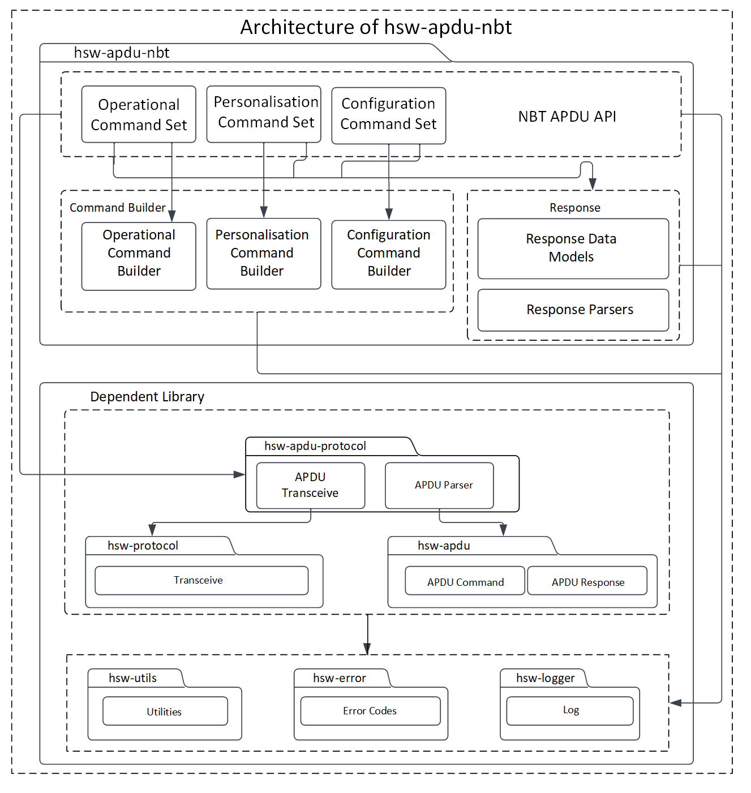
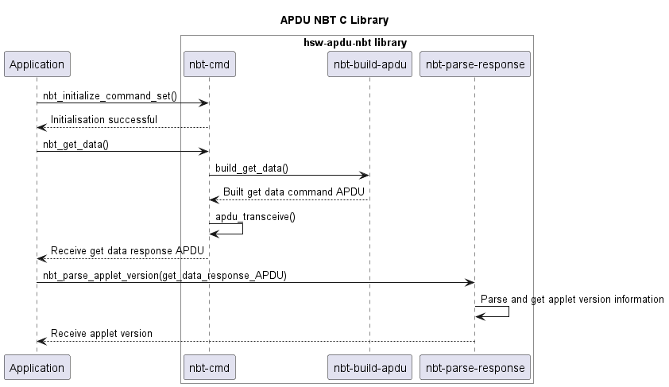

# NBT APDU library

> C library to communicate with the OPTIGA&trade; Authenticate NBT

The OPTIGA&trade; Authenticate NBT is a dynamic and secure turn-key solution for embedded NFC tag applications with varying levels of security and communication. The OPTIGA&trade; Authenticate NBT communicates with the smart phones and NFC readers via NFC and with the host MCU via I2C.

The OPTIGA&trade; Authenticate NBT APDU library allows the host application to send C-APDUs and receive R-APDUs from the OPTIGA&trade; Authenticate NBT controller. This library can be used with any communication channel, such as NFC and I2C.  

## Features

* Supports personalization and operational commands of the OPTIGA&trade; Authenticate NBT's Type-4-Tag applet
* Configuration via the OPTIGA&trade; Authenticate NBT configurator applet
* Extensible for any communication channel, such as NFC and I2C
* Supports pass-through APDUs

## Usage

1. Include the following headers

    ```c
    #include "infineon/ifx-error.h"
    #include "infineon/ifx-logger.h"
    #include "infineon/ifx-protocol.h"
    #include "infineon/ifx-t1prime.h"
    #include "infineon/ifx-utils.h"
    #include "infineon/nbt-apdu.h"
    #include "infineon/nbt-cmd.h"
    // Add the headers of I2C protocol implementation libraries (Example: PSoC6)
    // Add the headers of logger implementation libraries (Example: File logger)
    ```

2. Initialize the command set

    a. Initialize the logger handle

    ```c
    ifx_status_t status;

    // Logger handle to handle the printing of logs and error.
    ifx_logger_t logger_handle;

    // Initialize the logger using the platform-specific logger implementation APIs.
    // Note: Without this initialization, the logger does not work. Refer`hsw-nbt/docs/userguide.md` for platform-specific implementations.

        // Code placeholder 

    ifx_logger_set_level(&logger_handle, IFX_LOG_INFO);
    ```

    b. Initialize the protocol

    * GP T=1' I2C protocol

    ```c
    // Protocol to handle the GP T=1' I2C protocol communication with tag
    ifx_protocol_t t1prime_protocol;

    // Protocol to handle the MCU I2C drivers functionalities. 
    ifx_protocol_t mcu_i2c_driver;

    // Initialize the `ifx_protocol_t` object with the concrete implementation of the MCU I2C driver.
    // I2C protocol does not work without this initialization. Refer `hsw-nbt/docs/userguide.md` for platform-specific implementations.
    
        // Code placeholder

    // Use GP prime protocol channel as an interface to communicate with card.
    // Add I2C and Timer concrete implementation.  
    status = ifx_t1prime_initialize(&t1prime_protocol, &mcu_i2c_driver);

    status = ifx_protocol_activate(&t1prime_protocol, NULL, NULL);
    ```

    A sample API for implementation of MCU I2C driver initialization as per `ifx_protocol_t` struct is given below:

    ```c
    ifx_protocol_t mcu_i2c_driver;
    // Interface realization of PSoC6 I2C driver.
    status = ifx_i2c_psoc6_initialize(&mcu_i2c_driver, &logger_handle);
    ```

    c. Initialize the OPTIGA&trade; Authenticate NBT command set with the required protocol handle and logger handle

    * For GP T=1' I2C protocol

    ```c
    // NBT command set object to handle all OPTIGA&trade; Authenticate NBT operations.
    nbt_cmd_t command_set;
    // Initialize the OPTIGA&trade; Authenticate NBT command set with GP T=1' protocol
    status = nbt_initialize(&command_set, &t1prime_protocol, &logger_handle);
    ```

3. Communicate with the OPTIGA&trade; Authenticate NBT controller

    An example to update and read the NDEF message is illustrated below:

    ```c
    // Select the OPTIGA&trade; Authenticate NBT application.
    status = nbt_select_application(&command_set);
    if (ifx_error_check(status) || !IFX_CHECK_SW_OK(command_set.response->sw)) 
    {    
        // Read the corresponding error message.
        uint8_t *message = nbt_error_message_get(&command_set);

        // Handle error
    }

    // Assign the FileID to read/update NDEF message.
    uint16_t file_id = 0xE104;

    // Record value to be updated in NDEF message
    uint8_t ndef_message[] = {0xD1, 0x01, 0x0D, 0x55, 0x02, 0x69,
                              0x6E, 0x66, 0x69, 0x6E, 0x65, 0x6F,
                              0x6E, 0x2E, 0x63, 0x6F, 0x6D};

    ifx_blob_t blob;
    blob.length = sizeof(ndef_message);
    blob.buffer = ndef_message;
    // Update NDEF message with URI record details.
    status = nbt_ndef_update_with_id(&command_set, file_id, &blob);
    // Read the updated NDEF message.
    status = nbt_ndef_read_with_id(&command_set, file_id);
    // command_set.response->data has the content.

    // Select NDEF file by ID.
    status = nbt_select_file(&command_set, file_id);

    uint8_t offset = 0x00;
    uint32_t length = sizeof(ndef_message);
    // Read binary data from the selected file, Offset 0, and Length 17 bytes.
    status = nbt_read_binary(&command_set, 0x00, blob.length);
    // command_set.response->data has the content
    ```

## Architecture

This image shows the software architecture of the library.



## Components

* **Command set**
This component acts as the API interface for the host application. This module is responsible for coordinating the building of APDU commands, sending the commands to the secure element through the communication interface, and receiving response from the secure element. 
* **Command builder**
This component helps in framing the command APDUs according to the OPTIGA&trade; Authenticate NBT applet specification. 
* **Response parser**
This component helps in decoding the response APDUs including response data and status word according to the OPTIGA&trade; Authenticate NBT applet specification. 

## Interaction

Below diagram describes the interaction between the components.



## Directory structure

The library directory is structured according to the Pitchfork Layout.

```text
hsw-apdu-nbt 
|-- .cmake/                 # Includes sources for dependency management
|-- LICENSES/               # Includes list of licenses used for the library 
|-- data/                   # Includes Doxygen, cppcheck configuration files
|-- docs/                   # Includes documentation, source files, images, and the generated API reference
|-- include/                # Public Headers(.h) of the library
|-- src/                    # Sources(.c) and Private headers(.h) of the library
|-- .clang-format           # clang-format configuration file
|-- .gitignore              # Library specific gitignore file 
|-- CMakeLists.txt          # CMake build configurations for the library
`-- README.md               # Overview of the hsw-apdu-nbt library
```

## Dependencies

* **hsw-error**
    This dependent library is used for creating and parsing error information.

* **hsw-protocol**
    This dependent library provides the communication protocol interface for the OPTIGA&trade; Authenticate NBT APDU library. This protocol provides interfaces such as initialize, transceive, and terminate to communicate with an external application or product. This library can be implemented for any communication type, such as I2C, UART, and NFC. 

* **hsw-utils**
    This dependent library provides the utility methods such as for byte conversions, string conversions, bit operations, and encoders/decoders for 2-byte TLV data.

* **hsw-logger**
    This dependent library is used for logging information/errors. This library can be implemented for loggers like file-logger and console-logger.

* **hsw-apdu**
    This dependent library helps in building the APDU command bytes and parses the APDU response bytes according to the ISO/IEC 7816-4 specification.

* **hsw-apdu-protocol**
    This dependent library is used for sending and receiving APDU command bytes according to the ISO/IEC 7816-4 specification.

## References

* Infineon Technologies AG: *OPTIGA&trade; Authenticate NBT, Extended Datasheet*
