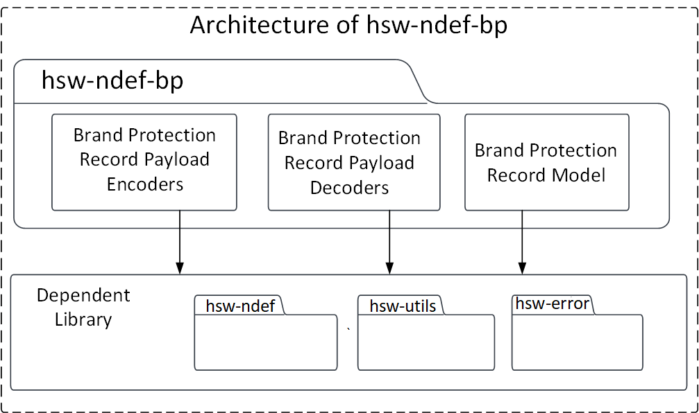
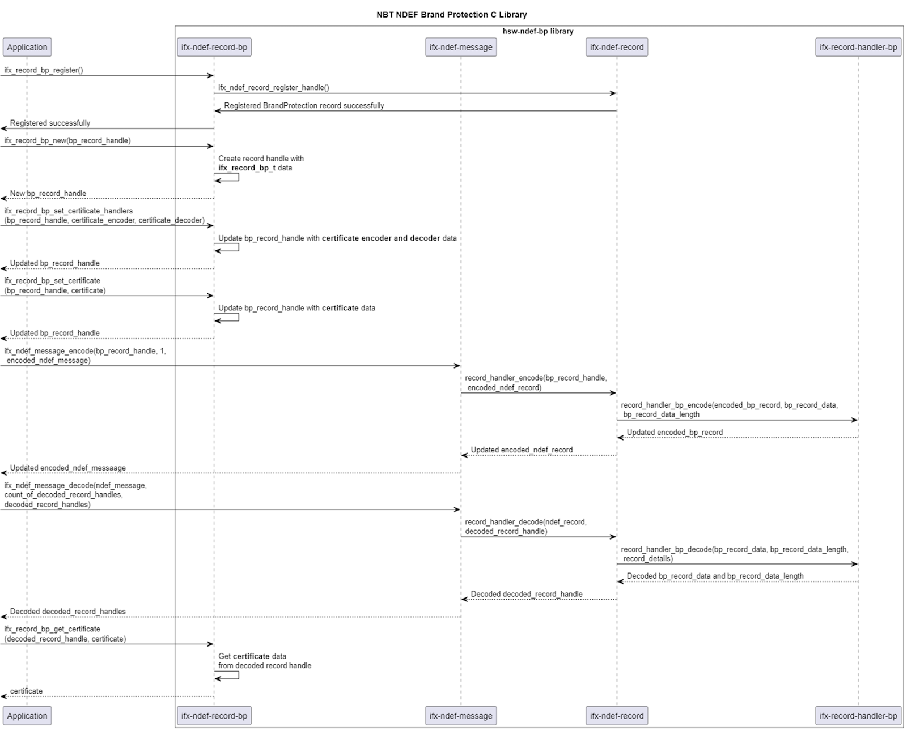

# NDEF brand protection library
> C library to encode and decode brand protection NDEF record and messages

The NFC data exchange format (NDEF) specification by [NFC Forum](https://nfc-forum.org/) defines a common data format to exchange information between NFC Forum devices.

This C library provides support to build and parse the NDEF brand protection messages, with support for common NDEF record type definitions.

## Features
* Build and parse the NDEF brand protection messages
* Build and parse the NDEF brand protection records

## Usage

1. Include the following headers
  ```c
  #include "infineon/ifx-record-bp.h"
  #include "infineon/ifx-ndef-message.h"
  #include "infineon/ifx-ndef-record.h"
  #include "infineon/ifx-utils.h"
  ```

2. Register the brand protection record into the NDEF C library
  ```c
  ifx_record_bp_register();
  ```

3. Create a new brand protection record
  ```c
  ifx_record_handle_t handle;
  ifx_record_bp_new(&handle);
  ```

4. Provide custom implementations to encode and decode the certificates

  Example: Certificate encoder custom implementation
  ```c
  ifx_status_t x509_certificate_encoder(const void * certificate, ifx_blob_t ** certificate_bytes)
  {
    // Implement code to encode X.509 certificate into byte array
    // Code placeholder
    return IFX_SUCCESS;
  }
  ```

  Example: Certificate decoder custom implementation
  ```c
  ifx_status_t x509_certificate_decoder(const ifx_blob_t * certificate_bytes, void * certificate)
  {
      // Implement code to decode X.509 certificate from byte array
      // Code placeholder
        return IFX_SUCCESS;
  }
  ```

5. Set the custom certificate encoder and decoder handles
  ```c
  ifx_record_bp_set_certificate_handlers(&handle, x509_certificate_encoder, x509_certificate_decoder);
  ```

6. Example for defining the certificate data type
  ```c
  // Example x509_certificate.
  typedef struct
  {
    char *issuer;
    char *subject;
    char *fingerprint;
    char *authority;
    ifx_blob_t public_key;
    ifx_blob_t signed_data;
    ifx_blob_t signature;
  } ifx_x509_certificate_example_t;
  ```

7. Assign a certificate to the created brand protection record
  ```c
  // Example: Declare a certificate
  ifx_x509_certificate_example_t certificate;
  // Assign the certificate.
  ifx_record_bp_set_certificate(&handle, (void *)&certificate);
  ```

8. Use the NDEF C library to encode the brand protection record into an NDEF message
  ```c
  uint32_t record_count = 0x01;
  ifx_blob_t ndef_message = {0};
  ifx_ndef_message_encode((ifx_record_handle_t *)&handle, record_count, &ndef_message);
  ```

  This NDEF message can be written into the NDEF file in the tag.

9. Use the NDEF C library to decode the brand protection record from an NDEF message
  ```c
  ifx_record_handle_t get_record_handle;
  uint32_t get_number_of_records = 0x00;
  ifx_ndef_message_decode(&ndef_message, &get_number_of_records, &get_record_handle);
  ```

10. Get the certificate from the record handle
  ```c
  ifx_record_bp_get_certificate(&get_record_handle, &certificate);
  ```

11. Release the memory allocated by the library
  ```c
  // free-up the internally allocated memory.
  status = ifx_ndef_record_release_resource(); 
  ```

## Architecture

Below image described the software architecture of the library.



## Components

* **Brand protection record models**
  This component contains the record models that are in-built supported by the library. These record models provide the structure for the record, which can be used to build the record.

* **Brand protection record payload encoders and decoders**
  This component contains the payload encoders and decoders which can be used to encode and decode the payload details into a byte array.

## Interaction
Below UML diagram describes the interaction between the components.



## Directory structure
The library directory is structured according to the Pitchfork Layout.

```
hsw-ndef-bp
|-- .cmake/                 # Includes sources for dependency management
|-- LICENSES/               # Includes list of licenses used for the library
|-- data/                   # Includes Doxygen, cppcheck configuration files
|-- docs/                   # Includes documentation source files, images, and the generated API reference
|-- include/                # Public Headers(.h) of the library
|-- src/                    # Sources(.c) and Private headers(.h) of the library
|-- .clang-format           # clang-format configuration file
|-- .gitignore              # Library specific gitignore file
|-- CMakeLists.txt          # CMake build configurations for the library
`-- README.md               # Overview of the hsw-ndef-bp library
```

## Dependencies

* **hsw-error**
  This dependent library is used for creating and parsing an error information.

* **hsw-ndef**
  This dependent library is used for creating the DEF RTDs and parsing the NDEF record information.

* **hsw-utils**
  This dependent library is used for utility functions such as string parsers.

## References

* Infineon Technologies AG: *OPTIGA&trade; Authenticate NBT, Extended Datasheet*
* NFC Data Exchange Format (NDEF), Technical Specification, NFC Forum™, NDEF 1.0
* NFC Record Type Definition (RTD), Technical Specification, NFC Forum™, RTD 1.0
