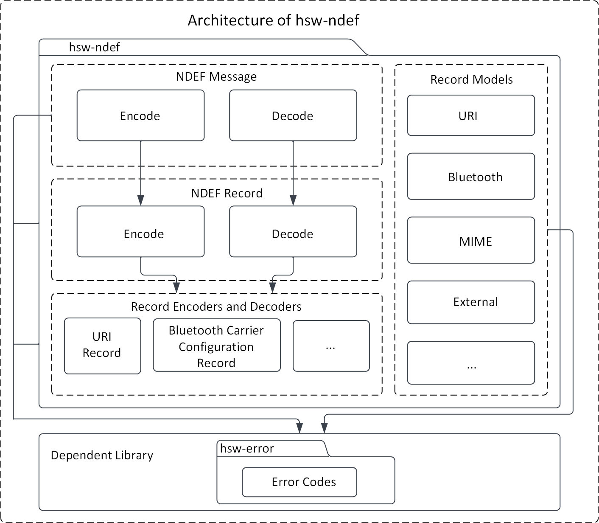
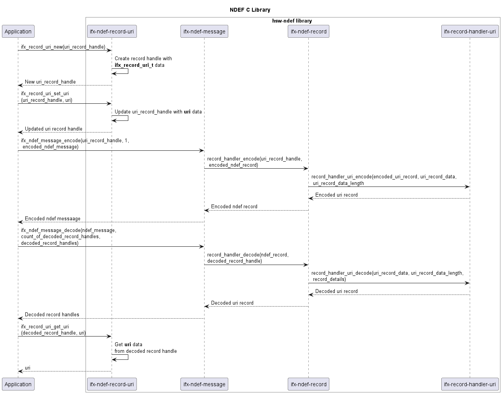

# NFC data exchange format (NDEF) library
> C library to encode and decode the NDEF messages

The NFC data exchange format (NDEF) specification by [NFC Forum](https://nfc-forum.org/) defines a common data format to exchange information between NFC Forum devices. An NDEF message is composed of one or more NDEF records. Each NDEF record contains the record type information and a payload.

This C library provides support to build and parse the NDEF messages, with support for common NDEF record type definitions. This library is extensible for addition of new record type definitions.

## Features

* Build and parse the NDEF messages
* Build and parse the NDEF records
* Supported records:
  * URI record
  * Bluetooth connection handover records (For static connection handover)
    * Bluetooth record `(application/vnd.bluetooth.ep.oob)`
    * Bluetooth LE record `(application/vnd.bluetooth.le.oob)`
    * Handover select record
    * Alternative carrier record
    * Error record
  * MIME type record
  * External type record

## Features not supported

* Record chunks

## Usage

1. Include the following headers

  ```c
  #include "infineon/ifx-error.h"
  #include "infineon/ifx-record-uri.h"
  #include "infineon/ifx-ndef-message.h"
  #include "infineon/ifx-ndef-record.h"
  #include "infineon/ifx-utils.h"
  ```

2. Encode the URI record

  ```c
  ifx_record_handle_t handles[2];
  uint8_t data_1[] = "infineon.com";
  uint8_t data_2[] = "github.com/infineon";

  ifx_blob_t uri_data_1;
  uri_data_1.buffer = data_1;
  uri_data_1.length = sizeof(data_1);

  ifx_blob_t uri_data_2;
  uri_data_2.buffer = data_2;
  uri_data_2.length = sizeof(data_2);

  // Create new URI record
  ifx_record_uri_new(&handles[0]);
  ifx_record_uri_new(&handles[1]);

  // Set identifier code of the URI record
  ifx_record_uri_set_identifier_code(&handles[0], IFX_URI_HTTPS_WWW);
  ifx_record_uri_set_identifier_code(&handles[1], IFX_URI_HTTPS);

  // Set URI field of the URI record
  ifx_record_uri_set_uri(&handles[0], &uri_data_1);
  ifx_record_uri_set_uri(&handles[1], &uri_data_2);
  ```

3. Encode the NDEF message

  ```c
  ifx_blob_t ndef_message;
  uint32_t number_of_records = 0x02;
  // Encode the record into the NDEF message
  ifx_status_t status = ifx_ndef_message_encode(&handles[0], number_of_records, &ndef_message);
  ```

4. Decode the NDEF message

  ```c
  uint32_t no_of_records = 0x00;

  // Decode the NDEF message into array of NDEF records
  status = ifx_ndef_message_decode(&ndef_message, &no_of_records, (ifx_record_handle_t *)&handles);
  ```

5. Decode the URI record

  ```c
  uint8_t identifier_code = 0;
  ifx_blob_t uri, uri_identifier, identifier;

  // Get the URI record identifier code
  status = ifx_record_uri_get_identifier_code(&handles[0], &identifier_code);

  // Get the URI record URI field
  status = ifx_record_uri_get_uri(&handles[0], &uri);

  // Get the URI record identifier as string
  status = ifx_record_uri_get_identifier(&handles[0], &identifier);

  // Get the URI record combining URI field with identifier
  status = ifx_record_uri_get_uri_with_identifier(&handles[0], &uri_identifier);
  ```
  
6. Release the memory allocated by the library 

  ```c
  // free-up the internally allocated memory.
  status = ifx_ndef_record_release_resource(); 
  ```

## Architecture

This image shows the software architecture of the library.



### Components

* **NDEF message**
  This component provides methods to encode array of records into an NDEF message and similarly decode an NDEF message into array of records.

* **Record models**
  This component contains the record models that are in-built supported by the library. These record models provide the structure for the record, which can be used to build the record. Example: `ifx_record_uri_set_uri(&record, "https://www.infineon.com")`

* **NDEF record**
  This component contains the methods to encode and decode the NDEF record headers.

* **Record payload encoders and decoders**
  This component contains the payload encoders and decoders, which can be used to encode and decode the payload details into a byte array.

### Interaction
Below UML diagram describes the interaction between the components.



### Directory structure
The code is structured according to the Pitchfork Layout.

```
hsw-ndef
|-- .cmake/                 # Includes sources for dependency management
|-- LICENSES/               # Includes list of licenses used for the library
|-- data/                   # Includes Doxygen, cppcheck configuration files
|-- docs/                   # Includes documentation source files, images, and the generated API reference
|-- include/                # Public Headers(.h) of the library
|-- src/                    # Sources(.c) and Private headers(.h) of the library
|-- .clang-format           # clang-format configuration file
|-- .gitignore              # Library specific gitignore file
|-- CMakeLists.txt          # CMake build configurations for the library
`-- README.md               # Overview of the hsw-ndef library
```

### Dependencies

* **hsw-error**
  This dependent library is used for creating and parsing an error information.

* **hsw-utils**
  This dependent library provides the utility methods such as for byte conversions, string conversions, bit operations, and encoders/decoders for 2-byte TLV data.

## References

* NFC Data Exchange Format (NDEF), Technical Specification, NFC Forum™, NDEF 1.0
* NFC Record Type Definition (RTD), Technical Specification, NFC Forum™, RTD 1.0
* URI Record Type Definition (RTD), Technical Specification, NFC Forum™, RTD-URI 1.0
* Connection Handover, Technical Specification, NFC Forum™, CH 1.4
* Bluetooth® Secure Simple Pairing Using NFC, Application Document, NFC Forum™, BTSSP 1.3
